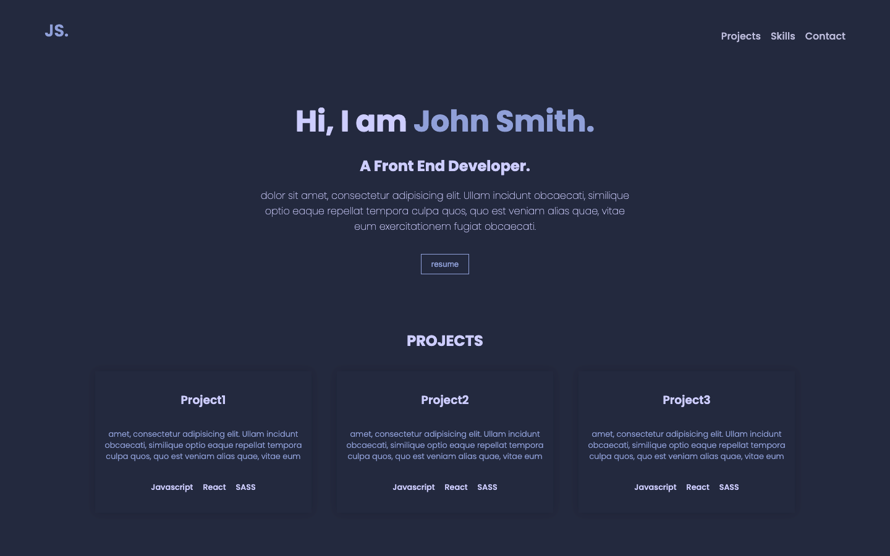

# Project JS React JS

A practical project for Supercode Fullstack Web-Dev Bootcamp.
The first day React Js and work with components. trying import and exporting the components. With Hover effect as Bonus in the Project. 

## Demo

You can check the result out in the following video:

https://youtu.be/n90jCNNWIv8

## Deployment

To deploy this project click the link below
https://chic-semolina-138f29.netlify.app/

## Tech Stack

**Client:** HTML, SCSS, Javascript, Vite, React

**Server:** Github Pages & Netlify

## Authors

- [@Samuel Aliyari](https://github.com/samuelaliyari)

## Screenshots

